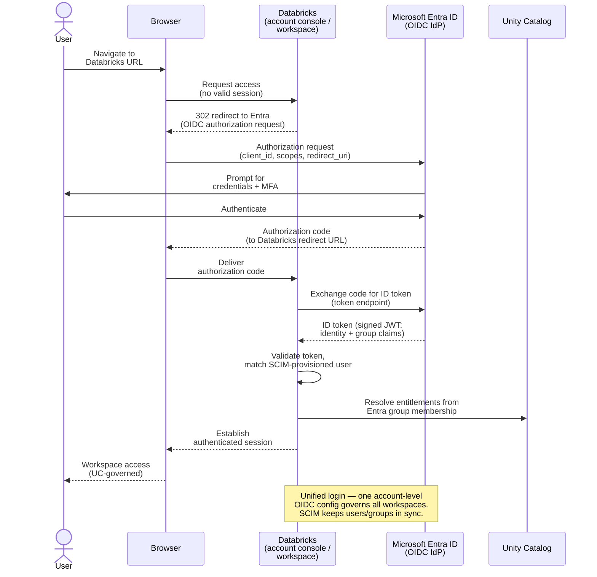
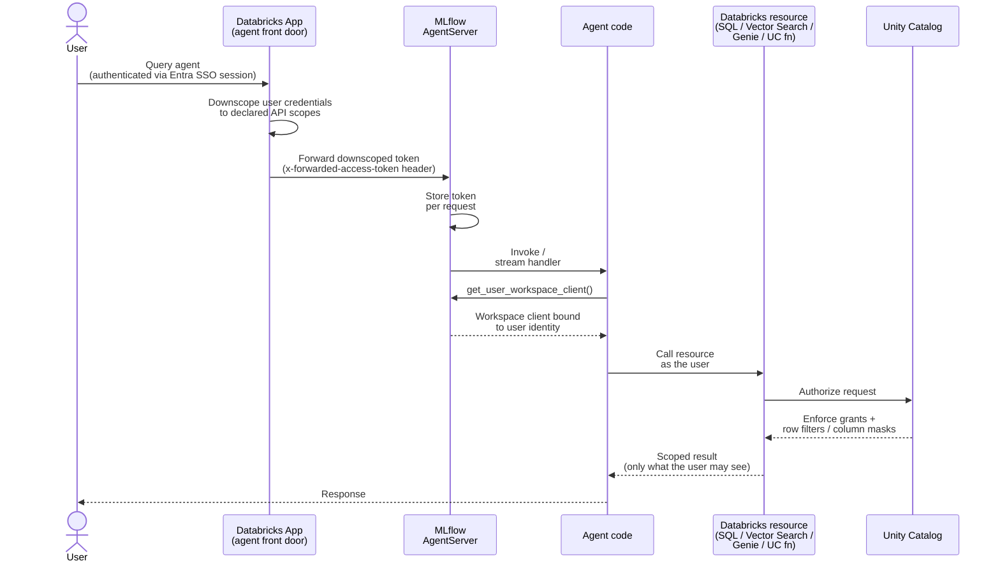

# Databricks User Provisioning (Terraform)

Terraform configuration that provisions a Databricks **group**, grants it
workspace access and entitlements, assigns it to a workspace, and sets up a
Unity Catalog **sandbox** (catalog + schemas + grants) and a shared **SQL
warehouse**.

It is designed around an **Entra ID (Azure AD) group** that represents your
developers (`app_devs`), but works with any identity provider or with
Databricks-native groups.

## Before you start - read these and setup SCIM

- Documentation to read: https://docs.databricks.com/aws/en/admin/users-groups/scim/
- Videos
  - Advancing Analytics - Provision Databricks Users through SCIM: https://www.youtube.com/watch?v=QU8uxFkox1c
  - Next Gen Lakehouse - SCIM Provisioning: https://youtu.be/AWPGQJRK6lo?si=g6FXeEXgpWhiV-3M


## What gets created

| File | Resources |
|------|-----------|
| `main.tf` | Provider config (account + workspace), shared SQL warehouse + permissions |
| `users_groups.tf` | Group reference, workspace entitlements, workspace assignment |
| `catalogs.tf` | Sandbox catalog, `experiments` + `triage` schemas, UC grants |
| `variables.tf` | Input variables |

### Entitlements granted to the group

- `workspace_access` — log in and use notebooks (**including serverless notebook compute**)
- `databricks_sql_access` — SQL warehouses / dashboards
- `allow_cluster_create` — **only in `dev`** (classic VM-based clusters); `false` in all other envs

## Prerequisites

- Terraform `>= 1.15.6`
- Databricks provider `~> 1.118.0` (pinned in `main.tf`)
- A Databricks **account ID** and a target **workspace** (host + numeric ID)
- The workspace must be **Unity Catalog-enabled** with a metastore assigned
- Credentials for both an **account-level** and a **workspace-level** provider
  (e.g. `DATABRICKS_TOKEN`, Azure CLI, or OAuth M2M)

## Configuration

Set these variables (via `terraform.tfvars`, `-var`, or environment variables):

| Variable | Description |
|----------|-------------|
| `databricks_account_id` | Databricks account ID (UUID) |
| `workspace_host` | Workspace URL, e.g. `https://adb-123.11.azuredatabricks.net` |
| `workspace_id` | Numeric workspace ID |
| `metastore_id` | Unity Catalog metastore ID |
| `entra_group_name` | Display name of the group to provision |
| `env` | Environment label (default `dev`); controls `allow_cluster_create` |
| `existing_entra_groups_exists` | Whether the group is already synced (see options below) |

Example `terraform.tfvars`:

```hcl
databricks_account_id = "00000000-0000-0000-0000-000000000000"
workspace_host        = "https://adb-1234567890123456.7.azuredatabricks.net"
workspace_id          = "1234567890123456"
metastore_id          = "11111111-2222-3333-4444-555555555555"
entra_group_name      = "app-devs"
env                   = "dev"
existing_entra_groups_exists = true
```

---

## Identity setup — choose your option

How you wire up the group depends on **(a)** whether you already have SCIM
provisioning, and **(b)** whether you want Databricks groups created for you or
managed by Terraform.

### Option 1 — You already have SCIM integration (recommended)

If your IdP (Entra ID / Okta / etc.) is **SCIM-provisioned** into the Databricks
**account**, your users and groups already exist in Databricks. Terraform should
**reference** the group, not create it — which is exactly what this config does:

```hcl
data "databricks_group" "app_devs" {
  provider     = databricks.account_provider
  display_name = var.entra_group_name
}
```

- Set `existing_entra_groups_exists = true`.
- Membership stays owned by your IdP — **do not** manage members in Terraform
  (SCIM would fight Terraform over the membership list).
- Terraform only manages entitlements, workspace assignment, and UC grants.

This is the cleanest model: **identity lifecycle in the IdP, access policy in Terraform.**

### Option 2 — No SCIM / you create groups in Databricks

If you do **not** have SCIM (or you want Terraform to own the group), declare the
group as a **resource** and manage its members. Replace the `data` source in
`users_groups.tf` with:

```hcl
resource "databricks_group" "app_devs" {
  provider     = databricks.account_provider
  display_name = var.entra_group_name
}

# Add account-level users (these must already exist, or create them too)
resource "databricks_group_member" "app_devs" {
  provider  = databricks.account_provider
  for_each  = toset(var.app_dev_user_emails)
  group_id  = databricks_group.app_devs.id
  member_id = databricks_user.app_devs[each.key].id
}

resource "databricks_user" "app_devs" {
  provider  = databricks.account_provider
  for_each  = toset(var.app_dev_user_emails)
  user_name = each.key
}
```

Then update every reference from `data.databricks_group.app_devs` to
`databricks_group.app_devs` (in `users_groups.tf`, `catalogs.tf`, and `main.tf`),
add a `app_dev_user_emails` list variable.

> **Note:** Creating users in Terraform triggers Databricks welcome emails and
> makes Terraform the source of truth for membership. Prefer **Option 1** if SCIM
> is available.

| | Option 1 (SCIM) | Option 2 (Terraform-managed) |
|---|---|---|
| Group exists already? | Yes (synced by IdP) | No — Terraform creates it |
| Group declared as | `data "databricks_group"` | `resource "databricks_group"` |
| Membership owned by | IdP (SCIM) | Terraform |
| `existing_entra_groups_exists` | `true` | `false` |
| Best when | You have SSO + SCIM | No SCIM, or full IaC ownership |

---

## Usage

```bash
terraform init
terraform plan
terraform apply
```

To validate without applying:

```bash
terraform validate
```

## Notes

- `allow_cluster_create` is environment-gated: classic clusters can be created
  only in `dev`. Serverless notebook compute is unaffected.
- The shared SQL warehouse (`shared_warehouse_<env>`) is granted `CAN_USE` to the
  group.
- The sandbox catalog is named `sandbox_<env>` with `experiments` and `triage`
  schemas; the group gets create/use privileges on both.


## How Authentication Works with SSO




## How On-behalf-of User Authentication works (OBO)

